# 世界冠军带你从零实践强化学习心得

[TOC]


## 写在前面

> 不要重复造轮子，学会使用轮子。

本文源于百度AI平台飞桨学院《[世界冠军带你从零实践强化学习](https://aistudio.baidu.com/aistudio/education/group/info/1335)》课程中我自己的心得和理解，感谢科科老师这几天精彩的讲解，带我们从小乌龟（Sarsa、Q-learning），到倒立摆（DQN，PG），再到四旋翼飞行器（DDPG），逐步领略强化学习的魅力。本文旨在介绍PARL框架的使用方法，并从模型的理解和代码的构建角度来整理所学内容，不求详尽但求简洁明了，看完都能学会`Model`、`Algorithm`、`Agent`的构建方法。我认为强化学习中对算法每一个概念的理解很重要，你可以不懂公式的推导，但是只要你理解了算法框图中的每一个步骤，那你就能够灵活的应用PARL框架去解决自己的问题。为了让大家理解代码的模块化构建，这篇文章只介绍Sarsa、Q-learning和DQN，前两者只用了一个`Agent`函数，后者用了PARL的`Model`、`Algorithm`、`Agent`模块，对比两种构建方式的不同，我们就可以很轻松的举一反三，PG和DDPG同样也可以用这三大模块构建。

依赖库是python初学者永远的痛点，相信很多人都有网上查到代码，本地一运行各种报错的经历，本文在各代码之前列举了所需依赖库，希望大家自己研究代码时能一次跑通。所有课程官方代码和作业答案都已上传至我的[GitHub](https://github.com/star2dust/parl-notes)，欢迎大家star一下，文章中有问题或疏漏的地方大家也可以直接查看源码。

开始之前我希望大家都具有python编程基础，一定程度上掌握Numpy的用法，这个库真的是很有用。没用过的可以参考我之前的文章（[查看这里](https://star2dust.github.io/numpy-notes/)）。学习过程中也可以参考大神的文章，推荐[Tiny Tony](https://www.zhihu.com/people/tiny-tony-5/posts)、[Mr.郑先生_](https://blog.csdn.net/zbp_12138/article/details/106800911)、[hhhsy](https://www.zhihu.com/people/hhhsy-9/posts)、[叶强](https://www.zhihu.com/people/qqiang00/posts)。

## 强化学习——从尝试到决策

> 每个人都是过去经验的总和。

### 初识强化学习

强化学习（Reinforcement learning，简称RL）是机器学习中的一个领域，强调如何基于环境而行动，以取得最大化的预期利益。核心思想是：智能体（agent）在环境（environment）中学习，根据环境的状态（state）或观测（observation），执行动作（action），并根据环境的反馈 （reward）来指导更好的动作。

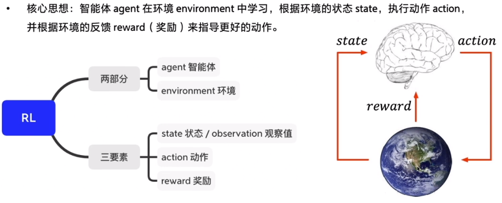

作为机器学习三巨头之一，强化学习和监督学习以及非监督学习关系如下图。


**监督学习关注的是认知，而强化学习关注的是决策**。简单的说，前者学习经验，后者运用经验。同样都是一张小熊的图片，监督学习输出的是灰熊、熊猫还是老虎，强化学习输出的是装死、逃跑还是干一架。


### 强化学习的分类和方法

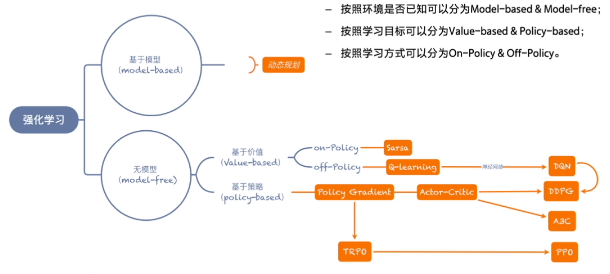

强化学习主要关注的是无模型的问题，在未知的环境中进行探索学习，在生活中有广泛的应用。


其探索方案有二：

- 基于价值的方法（Q函数）
  给每个状态都赋予一个价值的概念，来代表这个状态是好还是坏，这是一个相对的概念，让智能体往价值最高的方向行进。基于价值是确定性的。
- 基于策略的方法（Policy）
  制定出多个策略，策略里的每个动作都有一定的概率，并让每一条策略走到底,最后查看哪个策略是最优的。基于策略是随机性的。


### PARL框架和GYM环境

- 强化学习经典**环境库GYM**将环境（Env）交互接口规范化为：重置环境`reset()`、交互`step()`、渲染`render()`。
- 强化学习**框架库PARL**将强化学习框架抽象为: `Model`、`Algorithm`、`Agent`三层，使得强化学习算法的实现和调试更方便和灵活。（前两者有神经网络才用得上）

`Agent`的训练（Train）和测试（Test）过程直接上图展示如下。


本文所需全部依赖库代码如下，paddlepaddle默认使用CPU版本，可自行选用GPU版本，这里不再赘述。

```shell
# 可以直接 pip install -r requirements.txt
pip install paddlepaddle==1.6.3
pip install parl==1.3.1
pip install gym
pip install atari-py
pip install rlschool==0.3.1
```

## 基于表格型方法求解RL

> 没有什么比前人走过的路（Q）更有价值（V）。

### 序列决策的经典表达（MDP）

某一状态信息包含了所有相关的历史，只要当前状态可知，所有的历史信息都不再需要，当前状态就可以决定未来，则认为该状态具有**马尔科夫性**。**马尔可夫决策过程**（MDP）是序列决策的数学模型，它是一个无记忆的随机过程，可以用一个元组<S,P>表示，其中S是有限数量的状态集，P是状态转移概率矩阵。

强化学习中我们引入奖励R和动作A来描述环境，构成MDP五元组<S,A,P,R,$\gamma$>，其中P函数表示环境的随机性，R函数其实是P函数的一部分，表示获得的收益，$\gamma$是衰减因子以适当的减少对未来收益的考虑。


同样以熊问题为例，对应的是Model-free的情况，即P函数和R函数都未知的情况。这时我们用价值V代表某一状态的好坏，用Q函数来代表某个状态下哪个动作更好，即状态动作价值。

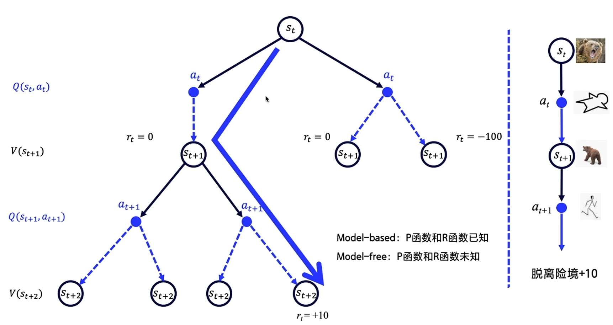

现实世界中，奖励R往往是延迟的，所以一般会从当前时间点开始，对后续可能得到的收益累加，以此来计算当前的价值。但是有时候目光不要放得太长远，**对远一些的东西当作近视看不见就好**。适当地引入一个衰减因子$\gamma$，再去计算未来的总收益，$\gamma$的值在0-1之间，时间点越久远，对当前的影响也就越小。

### 状态动作价值（Q）的求解

假设人走在树林里，先看到树上有熊爪后看到熊，接着就看到熊发怒了，经过很多次之后，原来要见到熊才瑟瑟发抖的，后来只要见到树上有熊爪就会有晕眩和害怕的感觉。也就是说，在不断地训练之后，下一个状态的价值可以不断地强化、影响上一个状态的价值。

这样的迭代状态价值的强化方式被称为时序差分（Temporal Difference）。单步求解Q函数，用$Q(S_{t+1},A_{t+1})$来近似$G_{t+1}$，以迭代的方式简化数学公式，最终使得$Q(S_t,A_t)$逼近目标值$G_t$。这里的目标值Target就是前面提到的未来收益的累加。

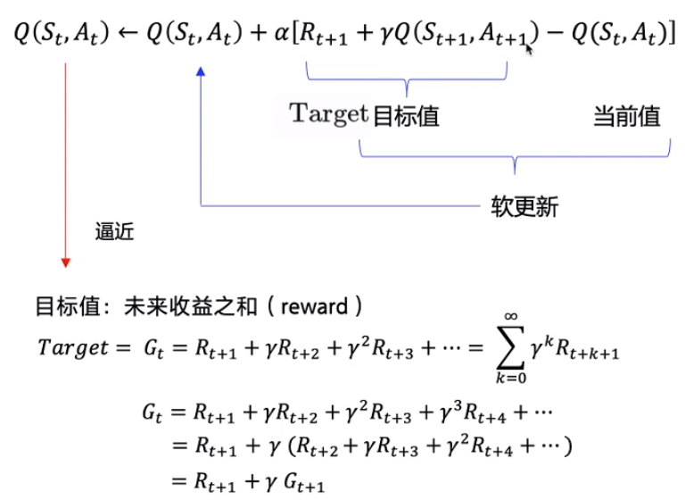

### Sarsa和Q-learning

**Sarsa**全称是state-action-reward-state’-action’，目的是学习特定的state下，特定action的价值Q，最终建立和优化一个Q表格，以state为行，action为列，根据与环境交互得到的reward来更新Q表格，更新公式即为上面的迭代公式。Sarsa在训练中为了更好的探索环境，采用ε-greedy方式（如下图）来训练，有一定概率随机选择动作输出。


**Q-learning**也是采用Q表格的方式存储Q值，探索部分与Sarsa是一样的，采用ε-greedy方式增加探索。

- Q-learning跟Sarsa不一样的地方是更新Q表格的方式，即learn()函数。
- Sarsa是on-policy，先做出动作再learn，Q-learning是off-policy，learn时无需获取下一步动作。

二者更新Q表格的方式分别为：

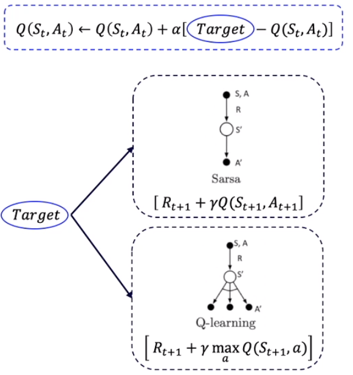

二者算法对比如下图所示，有三处不同点。


on-policy优化的是目标策略，用下一步一定会执行的动作来优化Q表格；off-policy实际上有两种不同的策略，期望得到的目标策略和大胆探索的行为策略，在目标策略的基础上用行为策略获得更多的经验。


### 代码构建与演示

```python
import numpy as np
```

Sarsa Agent构建

```python
class SarsaAgent(object):
    def __init__(self,
                 obs_n,
                 act_n,
                 learning_rate=0.01,
                 gamma=0.9,
                 e_greed=0.1):
        self.act_n = act_n  # 动作维度，有几个动作可选
        self.lr = learning_rate  # 学习率
        self.gamma = gamma  # reward的衰减率
        self.epsilon = e_greed  # 按一定概率随机选动作
        self.Q = np.zeros((obs_n, act_n))

    # 根据输入观察值，采样输出的动作值，带探索
    def sample(self, obs):
        if np.random.uniform(0, 1) < (1.0 - self.epsilon):  #根据table的Q值选动作
            action = self.predict(obs)
        else:
            action = np.random.choice(self.act_n)  #有一定概率随机探索选取一个动作
        return action

    # 根据输入观察值，预测输出的动作值
    def predict(self, obs):
        Q_list = self.Q[obs, :]
        maxQ = np.max(Q_list)
        action_list = np.where(Q_list == maxQ)[0]  # maxQ可能对应多个action
        action = np.random.choice(action_list)
        return action

    # 学习方法，也就是更新Q-table的方法
    def learn(self, obs, action, reward, next_obs, next_action, done):
        """ on-policy
            obs: 交互前的obs, s_t
            action: 本次交互选择的action, a_t
            reward: 本次动作获得的奖励r
            next_obs: 本次交互后的obs, s_t+1
            next_action: 根据当前Q表格, 针对next_obs会选择的动作, a_t+1
            done: episode是否结束
        """
        predict_Q = self.Q[obs, action]
        if done:
            target_Q = reward  # 没有下一个状态了
        else:
            target_Q = reward + self.gamma * self.Q[next_obs,
                                                    next_action]  # Sarsa
        self.Q[obs, action] += self.lr * (target_Q - predict_Q)  # 修正q
```

Q-learning Agent构建

```python
class QLearningAgent(object):
    def __init__(self,
                 obs_n,
                 act_n,
                 learning_rate=0.01,
                 gamma=0.9,
                 e_greed=0.1):
        self.act_n = act_n  # 动作维度，有几个动作可选
        self.lr = learning_rate  # 学习率
        self.gamma = gamma  # reward的衰减率
        self.epsilon = e_greed  # 按一定概率随机选动作
        self.Q = np.zeros((obs_n, act_n))

    # 根据输入观察值，采样输出的动作值，带探索
    def sample(self, obs):
        # 内容略，和sarsa一样
        return action

    # 根据输入观察值，预测输出的动作值
    def predict(self, obs):
        # 内容略，和sarsa一样
        return action

    # 学习方法，也就是更新Q-table的方法
    def learn(self, obs, action, reward, next_obs, done):
        """ off-policy
            obs: 交互前的obs, s_t
            action: 本次交互选择的action, a_t
            reward: 本次动作获得的奖励r
            next_obs: 本次交互后的obs, s_t+1
            done: episode是否结束
        """
        predict_Q = self.Q[obs, action]
        if done:
            target_Q = reward  # 没有下一个状态了
        else:
            target_Q = reward + self.gamma * np.max(
                self.Q[next_obs, :])  # Q-learning
        self.Q[obs, action] += self.lr * (target_Q - predict_Q)  # 修正q
```

训练过程代码如下：

```python
# train.py
import gym
from gridworld import CliffWalkingWapper, FrozenLakeWapper
from agent import SarsaAgent
import time


def run_episode(env, agent, render=False):
    total_steps = 0  # 记录每个episode走了多少step
    total_reward = 0

    obs = env.reset()  # 重置环境, 重新开一局（即开始新的一个episode）
    action = agent.sample(obs)  # 根据算法选择一个动作

    while True:
        next_obs, reward, done, _ = env.step(action)  # 与环境进行一个交互
        next_action = agent.sample(next_obs)  # 根据算法选择一个动作
        # 训练 Sarsa 算法
        agent.learn(obs, action, reward, next_obs, next_action, done)
        action = next_action # 存储上一个动作
        # 训练 q-learing 算法
        # agent.learn(obs, action, reward, next_obs, done)
        
        obs = next_obs  # 存储上一个观察值
        total_reward += reward
        total_steps += 1  # 计算step数
        if render:
            env.render()  #渲染新的一帧图形
        if done:
            break
    return total_reward, total_steps


def test_episode(env, agent):
    total_reward = 0
    obs = env.reset()
    while True:
        action = agent.predict(obs)  # greedy
        next_obs, reward, done, _ = env.step(action)
        total_reward += reward
        obs = next_obs
        time.sleep(0.5)
        env.render()
        if done:
            print('test reward = %.1f' % (total_reward))
            break


def main():
    # env = gym.make("FrozenLake-v0", is_slippery=False)  # 0 left, 1 down, 2 right, 3 up
    # env = FrozenLakeWapper(env)

    env = gym.make("CliffWalking-v0")  # 0 up, 1 right, 2 down, 3 left
    env = CliffWalkingWapper(env)

    agent = SarsaAgent(
        obs_n=env.observation_space.n,
        act_n=env.action_space.n,
        learning_rate=0.1,
        gamma=0.9,
        e_greed=0.1) # 或 QLearningAgent

    is_render = False
    for episode in range(500):
        ep_reward, ep_steps = run_episode(env, agent, is_render)
        print('Episode %s: steps = %s , reward = %.1f' % (episode, ep_steps,
                                                          ep_reward))

        # 每隔20个episode渲染一下看看效果
        if episode % 20 == 0:
            is_render = True
        else:
            is_render = False
    # 训练结束，查看算法效果
    test_episode(env, agent)


if __name__ == "__main__":
    main()
```

可以看到二者区别全在`learn`函数，训练过程的差别也仅在`learn`的输入是否有`next_action`。大家可以尝试用命令行运行以下演示代码（[这里下载](https://github.com/star2dust/parl-notes)），训练环境是悬崖问题（CliffWalking）。作业中的冰湖问题（FrozenLake）见`.\tutorials\homework`文件夹。

```shell
# sarsa 演示
cd .\tutorials\lesson2\sarsa
python .\train.py
# q-learing 演示
cd .\tutorials\lesson2\q_learning
python .\train.py
```

最终结果如下面的GIF所示。可以看出来Sarsa比较保守，会选择下限最高的路线，即尽可能远离悬崖的路线，虽然路程远了，但至少掉下悬崖的风险就小了很多；而Q-learning比较激进，会选择上限最高的路线，即路程最近的路线，但存在些微扰动便可能掉下悬崖。

Sarsa训练图：


Q-learning训练图：

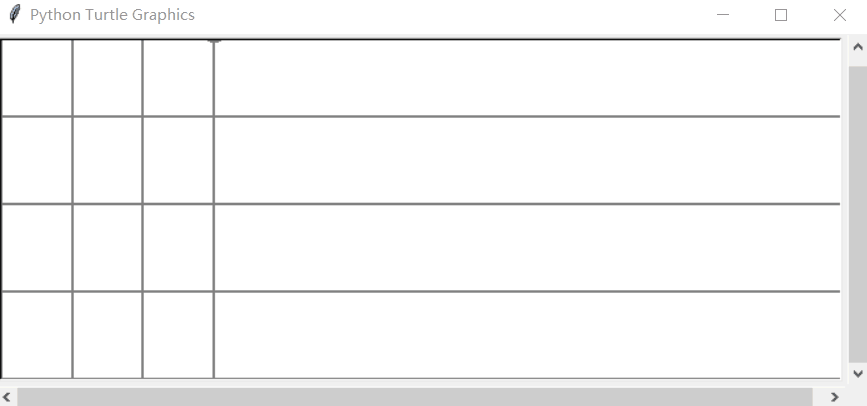

## 基于神经网络方法求解RL

> 选择（A）有限，而人生（S）无限。

### 神经网络近似Q函数

前面提到的悬崖问题，状态（S）总量很少，但实际生活中，很多常见问题的状态都是数量庞大的，如象棋、围棋等。即使用Q表格装下所有状态，表格可能占用极大内存，表格的查找也相当费时。我们就可以用带参数的Q函数来近似Q表格，比如可以用多项式函数或者神经网络，优势是**只需要输出少量参数，同时能实现状态泛化**。

神经网络结构如下图所示。

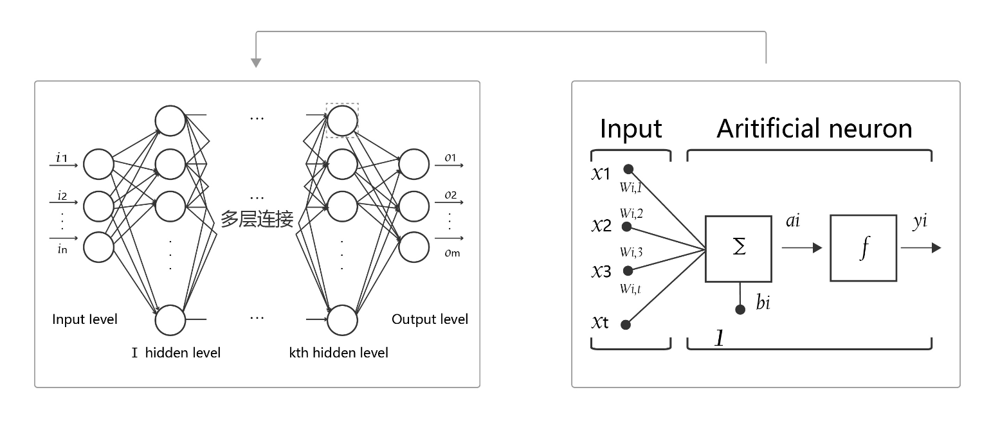

- **神经元**：神经网络中每个节点称为神经元，由两部分组成：
  - 加权和：将所有输入加权求和。
  - 非线性变换（**激活函数**）：加权和的结果经过一个非线性函数变换，让神经元计算具备**非线性**的能力。
- **多层连接：** 大量这样的节点按照不同的层次排布，形成多层的结构连接起来，即称为神经网络。
- **前向计算：** 从输入计算输出的过程，顺序从网络前至后。
- **计算图：** 以图形化的方式展现神经网络的计算逻辑又称为计算图。我们也可以将神经网络的计算图以公式的方式表达为$Y=f_3(f_2(f_1(w_1x_1+w_2x_2+w_3x_3+b)+\cdots)+\cdots)$

由此可见，神经网络的本质是一个含有很多参数的“大公式”。

### DQN：入门deep RL

DQN本质上是一个Q-learning算法，但使用神经网络来近似替代Q表格。

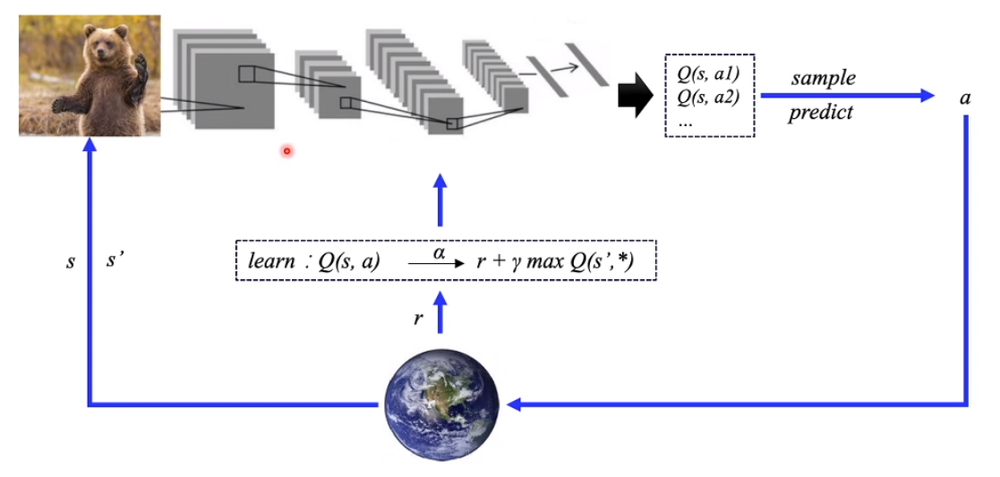

类比监督学习的训练，DQN的训练过程也非常地类似，它输入的是一批状态（S），输出的是对应的Q。计算输出的Q与Target Q的均方差，进行优化，以此更新神经网络参数。

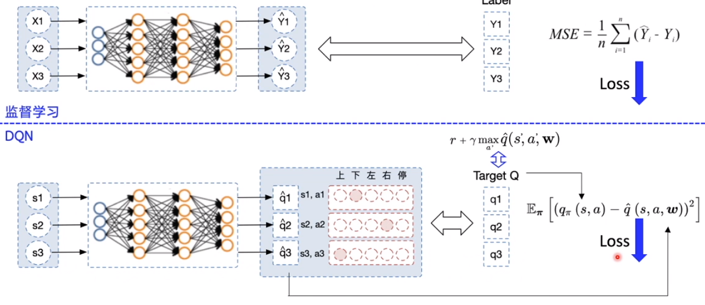

在Q-learning的基础上，DQN提出了两个技巧使得Q网络的更新迭代更稳定:

- **经验回放** （Experience Replay）：主要解决样本关联性和利用效率的问题。使用一个经验池（buffer）存储多条经验（s,a,r,s’），再从中随机抽取一批（batch）数据送去训练。
- **固定Q目标** （Fixed-Q-Target）：主要解决算法训练不稳定的问题。每隔一段时间复制一次网络参数（w），保证用于计算Target Q的Q函数不变。

### 代码构建与演示

这部分代码构建展示了PARL框架的基本用法，即`Model`、`Algorithm`、`Agent`嵌套。`Algorithm`是`Agent`的一部分，`Model`又是`Algorithm`的一部分，相比较前文中只有一个`Agent`的简单代码模块性更好，但理解起来也更复杂，容我慢慢道来。

```python
import parl
from parl import layers
import paddle.fluid as fluid
import copy
import numpy as np
```

- `Model`用来定义前向(`Forward`)网络，用户可以自由的定制自己的神经网络结构。

```python
class Model(parl.Model):
    def __init__(self, act_dim):
        hid1_size = 128
        hid2_size = 128
        # 3层全连接（fc）网络，act选择激活函数，不使用激活函数即线性
        self.fc1 = layers.fc(size=hid1_size, act='relu')
        self.fc2 = layers.fc(size=hid2_size, act='relu')
        self.fc3 = layers.fc(size=act_dim, act=None)

    def value(self, obs):
        # 前向计算 Q实际上是一个二维数组
        # 输入state，输出所有action对应的Q，[Q(s,a1), Q(s,a2), Q(s,a3)...]
        h1 = self.fc1(obs)
        h2 = self.fc2(h1)
        Q = self.fc3(h2)
        return Q
```

- `Algorithm` 定义了具体的算法来更新前向网络(`Model`)，也就是通过定义损失函数来更新`Model`，和算法相关的计算都放在`algorithm`中。

```python
# from parl.algorithms import DQN # 也可以直接从parl库中导入DQN算法

class DQN(parl.Algorithm):
    def __init__(self, model, act_dim=None, gamma=None, lr=None):
        """ DQN algorithm
        
        Args:
            model (parl.Model): 定义Q函数的前向网络结构
            act_dim (int): action空间的维度，即有几个action
            gamma (float): reward的衰减因子
            lr (float): learning rate 学习率.
        """
        self.model = model
        self.target_model = copy.deepcopy(model)
        # 参数的类型要求，且必须有输入
        assert isinstance(act_dim, int)
        assert isinstance(gamma, float)
        assert isinstance(lr, float)
        self.act_dim = act_dim
        self.gamma = gamma
        self.lr = lr

    def predict(self, obs):
        """ 使用self.model的value网络来获取 [Q(s,a1),Q(s,a2),...]
        """
        return self.model.value(obs)

    def learn(self, obs, action, reward, next_obs, terminal):
        """ 使用DQN算法更新self.model的value网络
        """
        # 从target_model中获取 max Q' 的值，用于计算target_Q
        next_pred_value = self.target_model.value(next_obs)        
        # dim=0指最外边的[]，dim增加向内数一个[]
        # 这里value都自带两个[]，所以dim=1，计算里面那个[]
        best_v = layers.reduce_max(next_pred_value, dim=1)
        # 阻止梯度传递保证target不变，否则paddle的优化器默认迭代一步梯度
        best_v.stop_gradient = True  
        # 判断是否是最后一条经验
        terminal = layers.cast(terminal, dtype='float32')
        target = reward + (1.0 - terminal) * self.gamma * best_v

        pred_value = self.model.value(obs)  # 获取Q预测值
        # 将action转onehot向量，比如：3 => [0,0,0,1,0]
        action_onehot = layers.one_hot(action, self.act_dim)
        action_onehot = layers.cast(action_onehot, dtype='float32')
        # 下面一行是逐元素相乘，拿到action对应的 Q(s,a)
        # 比如：pred_value = [[2.3, 5.7, 1.2, 3.9, 1.4]], action_onehot = [[0,0,0,1,0]]
        #  ==> pred_action_value = [[3.9]]
        pred_action_value = layers.reduce_sum(
            layers.elementwise_mul(action_onehot, pred_value), dim=1)

        # 计算 Q(s,a) 与 target_Q的均方差，得到loss
        cost = layers.square_error_cost(pred_action_value, target)
        cost = layers.reduce_mean(cost)
        optimizer = fluid.optimizer.Adam(learning_rate=self.lr)  # 使用Adam优化器
        optimizer.minimize(cost)
        return cost

    def sync_target(self):
        """ 把 self.model 的模型参数值同步到 self.target_model
        """
        # 同步参数就行，比直接copy效率高
        self.model.sync_weights_to(self.target_model)
```

- `Agent` 负责算法与环境的交互，在交互过程中把生成的数据提供给`Algorithm`来更新模型(`Model`)，数据的预处理流程也一般定义在这里。

```python
class Agent(parl.Agent):
    def __init__(self,
                 algorithm,
                 obs_dim,
                 act_dim,
                 e_greed=0.1,
                 e_greed_decrement=0):
        assert isinstance(obs_dim, int)
        assert isinstance(act_dim, int)
        self.obs_dim = obs_dim
        self.act_dim = act_dim
        # 将Algorithm传入Agent，即self.alg
        super(Agent, self).__init__(algorithm)

        self.global_step = 0
        self.update_target_steps = 200  
        # 每隔200个training steps再把model的参数复制到target_model中

        self.e_greed = e_greed  # 有一定概率随机选取动作，探索
        self.e_greed_decrement = e_greed_decrement  # 随着训练逐步收敛，探索的程度慢慢降低

    def build_program(self):
        # 这一部分是搭建predict和learn框架，给定数据大小和类型
        # 至于输入实际数据的代码，在后面的predict和learn函数
        self.pred_program = fluid.Program()
        self.learn_program = fluid.Program()

        with fluid.program_guard(self.pred_program):  
            # 搭建计算图用于 预测动作，定义输入输出变量
            obs = layers.data(
                name='obs', shape=[self.obs_dim], dtype='float32')
            self.value = self.alg.predict(obs)

        with fluid.program_guard(self.learn_program):  
            # 搭建计算图用于 更新Q网络，定义输入输出变量
            obs = layers.data(
                name='obs', shape=[self.obs_dim], dtype='float32')
            action = layers.data(name='act', shape=[1], dtype='int32')
            reward = layers.data(name='reward', shape=[], dtype='float32')
            next_obs = layers.data(
                name='next_obs', shape=[self.obs_dim], dtype='float32')
            terminal = layers.data(name='terminal', shape=[], dtype='bool')
            self.cost = self.alg.learn(obs, action, reward, next_obs, terminal)

    def sample(self, obs):
        sample = np.random.rand()  # 产生0~1之间的小数
        if sample < self.e_greed:
            act = np.random.randint(self.act_dim)  # 探索：每个动作都有概率被选择
        else:
            act = self.predict(obs)  # 选择最优动作
        # 前面和sarsa基本一样，不同的是随着训练逐步收敛，探索的程度慢慢降低
        self.e_greed = max(
            0.01, self.e_greed - self.e_greed_decrement)     
        return act

    def predict(self, obs):  # 选择最优动作，和sample的else部分一致
        # 扩展维度，因为obs是[...]，但是Q是[[...]]
        obs = np.expand_dims(obs, axis=0)
        pred_Q = self.fluid_executor.run(
            self.pred_program,
            feed={'obs': obs.astype('float32')},
            fetch_list=[self.value])[0]
        # 降低维度，理由同上
        pred_Q = np.squeeze(pred_Q, axis=0) # 若axis=0的维度len==1则移除
        act = np.argmax(pred_Q)  # 选择Q最大的下标，即对应的动作
        return act

    def learn(self, obs, act, reward, next_obs, terminal):
        # 每隔200个training steps同步一次model和target_model的参数
        if self.global_step % self.update_target_steps == 0:
            self.alg.sync_target()
        self.global_step += 1

        act = np.expand_dims(act, -1)
        feed = {
            'obs': obs.astype('float32'),
            'act': act.astype('int32'),
            'reward': reward,
            'next_obs': next_obs.astype('float32'),
            'terminal': terminal
        }
        cost = self.fluid_executor.run(
            self.learn_program, feed=feed, fetch_list=[self.cost])[0]  # 训练一次网络
        return cost
```

- 经验池`replay_memory`：用于存储多条经验，实现经验回放。

```python
# replay_memory.py
import random
import collections
import numpy as np


class ReplayMemory(object):
    def __init__(self, max_size):
        self.buffer = collections.deque(maxlen=max_size)

    # 增加一条经验到经验池中
    def append(self, exp):
        self.buffer.append(exp)

    # 从经验池中选取N条经验出来
    def sample(self, batch_size):
        mini_batch = random.sample(self.buffer, batch_size)
        obs_batch, action_batch, reward_batch, next_obs_batch, done_batch = [], [], [], [], []

        for experience in mini_batch:
            s, a, r, s_p, done = experience
            obs_batch.append(s)
            action_batch.append(a)
            reward_batch.append(r)
            next_obs_batch.append(s_p)
            done_batch.append(done)

        return np.array(obs_batch).astype('float32'), \
            np.array(action_batch).astype('float32'), 				np.array(reward_batch).astype('float32'),\
            np.array(next_obs_batch).astype('float32'), np.array(done_batch).astype('float32')

    def __len__(self):
        return len(self.buffer)
```

训练过程代码如下：

```python
# train.py
import os
import gym
import numpy as np
import parl
from parl.utils import logger  # 日志打印工具

from model import Model
from algorithm import DQN  # from parl.algorithms import DQN  # parl >= 1.3.1
from agent import Agent

from replay_memory import ReplayMemory

LEARN_FREQ = 5  # 训练频率，不需要每一个step都learn，攒一些新增经验后再learn，提高效率
MEMORY_SIZE = 20000  # replay memory的大小，越大越占用内存
MEMORY_WARMUP_SIZE = 200  # replay_memory 里需要预存一些经验数据，再从里面sample一个batch的经验让agent去learn
BATCH_SIZE = 32  # 每次给agent learn的数据数量，从replay memory随机里sample一批数据出来
LEARNING_RATE = 0.001  # 学习率
GAMMA = 0.99  # reward 的衰减因子，一般取 0.9 到 0.999 不等


# 训练一个episode
def run_episode(env, agent, rpm):
    total_reward = 0
    obs = env.reset()
    step = 0
    while True:
        step += 1
        action = agent.sample(obs)  # 采样动作，所有动作都有概率被尝试到
        next_obs, reward, done, _ = env.step(action)
        rpm.append((obs, action, reward, next_obs, done))

        # train model 每次learn都随机抽样
        if (len(rpm) > MEMORY_WARMUP_SIZE) and (step % LEARN_FREQ == 0):
            (batch_obs, batch_action, batch_reward, batch_next_obs,
             batch_done) = rpm.sample(BATCH_SIZE)
            train_loss = agent.learn(batch_obs, batch_action, batch_reward,
                                     batch_next_obs,
                                     batch_done)  # s,a,r,s',done

        total_reward += reward
        obs = next_obs
        if done:
            break
    return total_reward


# 评估 agent, 跑 5 个episode，总reward求平均
def evaluate(env, agent, render=False):
    eval_reward = []
    for i in range(5):
        obs = env.reset()
        episode_reward = 0
        while True:
            action = agent.predict(obs)  # 预测动作，只选最优动作
            obs, reward, done, _ = env.step(action)
            episode_reward += reward
            if render:
                env.render()
            if done:
                break
        eval_reward.append(episode_reward)
    return np.mean(eval_reward)


def main():
    env = gym.make(
        'CartPole-v0'
    )  # CartPole-v0: expected reward > 180                MountainCar-v0 : expected reward > -120
    action_dim = env.action_space.n  # CartPole-v0: 2
    obs_shape = env.observation_space.shape  # CartPole-v0: (4,)

    rpm = ReplayMemory(MEMORY_SIZE)  # DQN的经验回放池

    # 根据parl框架构建agent
    model = Model(act_dim=action_dim)
    algorithm = DQN(model, act_dim=action_dim, gamma=GAMMA, lr=LEARNING_RATE)
    agent = Agent(
        algorithm,
        obs_dim=obs_shape[0],
        act_dim=action_dim,
        e_greed=0.1,  # 有一定概率随机选取动作，探索
        e_greed_decrement=1e-6)  # 随着训练逐步收敛，探索的程度慢慢降低

    # 加载模型
    # save_path = './dqn_model.ckpt'
    # agent.restore(save_path)

    # 先往经验池里存一些数据，避免最开始训练的时候样本丰富度不够
    while len(rpm) < MEMORY_WARMUP_SIZE:
        run_episode(env, agent, rpm)

    max_episode = 2000

    # start train
    episode = 0
    while episode < max_episode:  # 训练max_episode个回合，test部分不计算入episode数量
        # train part
        for i in range(0, 50):
            total_reward = run_episode(env, agent, rpm)
            episode += 1

        # test part
        eval_reward = evaluate(env, agent, render=True)  # render=True 查看显示效果
        logger.info('episode:{}    e_greed:{}   Test reward:{}'.format(
            episode, agent.e_greed, eval_reward))

    # 训练结束，保存模型
    save_path = './dqn_model.ckpt'
    agent.save(save_path)


if __name__ == '__main__':
    main()
```

大家可以尝试用命令行运行以下演示代码（[这里下载](https://github.com/star2dust/parl-notes)），训练环境是倒立摆问题（CartPole），倒立摆可以说是强化学习中的hello world，入门必备。作业中的小车上山问题（MountainCar）见`.\tutorials\homework`文件夹。

```python
# DQN 演示
cd .\tutorials\lesson3\dqn
python .\train.py
cd .\tutorials\homework\lesson3\dqn_mountaincar
python .\train.py
```

最终DQN结果如下面的GIF所示。

倒立摆（CartPole）：

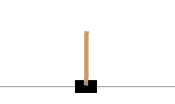

小车上山（MountainCar）：

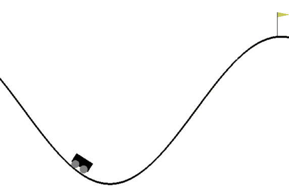

## 总结

框架库PARL将强化学习框架抽象为: `Model`、`Algorithm`、`Agent`三层，使得强化学习算法的实现和调试更方便和灵活。前两者尤其针对deep RL的情况，有神经网络时直接调用paddle的api可以很方便的进行网络和算法的构建。本文由强化学习经典算法Sarsa和Q-learning扩展到deep RL的DQN算法，并以DQN为例讲解了PARL的使用方法。下篇文章我会讲基于policy的PG算法和用于连续状态控制的DDPG，敬请期待。